# ग्रामिणी AI · Gramini AI
## Complete Architecture & Design Document

**Team Viykon** · ACM SIGCHI IIIT Pune × IIT Bombay
**Theme:** Human-Centered Design of Large Language Model Interfaces
**Primary:** PS07 — Human-Centered AI for Rural Communities
**Supporting:** PS03 — Government Schemes & Public Services

---

## ⚠️ Read this first — corrections to the project brief

This document describes **what is actually built and running**, verified against
the live system. Three things in the original brief do not match the code. They
are corrected here so nobody puts a wrong claim on a slide and gets caught in
Q&A.

| Brief said | Reality | Why it matters |
|---|---|---|
| **Framer Motion** | **Not used.** The only runtime dependencies are `react` and `react-dom`. All animation is CSS keyframes. | This is a *stronger* story, not a weaker one — see §2.7. Do not claim a library we do not ship. |
| **Gemini Pro API** | `gemini-3.5-flash` configured, with automatic failover through a six-model chain. Currently running `gemini-3.1-flash-lite`. | A judge may ask which model. "Pro" would be wrong. |
| **3 languages** | **24 languages**, in two tiers. | We under-claimed. |

Additionally, two significant features exist that the brief does not list:
**live weather** (§5.7) and **offline recorded audio** (§5.6).

**Verified live state at time of writing:**

| Metric | Value |
|---|---|
| Government schemes | 9 |
| Scheme data status | `partial` (see §9.3 — this is deliberate honesty, not an omission) |
| Languages | 24 (3 hand-verified, 21 machine-translated) |
| Translation caches on disk | 9 languages |
| Recorded audio clips | 17 |
| Weather locations cached | 10 |
| Backend modules | 11 |
| Frontend modules | 25 |
| Automated tests | 37 scheme-matcher cases + offline suite + voice suites |

---

# 1. Introduction

## 1.1 What Gramini AI is

Gramini AI is a **voice-first assistant for rural India**. The user speaks. They
never type. It answers in their own language about government schemes, weather,
health and rights — and every scheme answer carries the government website it
came from.

## 1.2 Why it exists

India runs hundreds of welfare schemes. The money is allocated. The problem is
not availability — it is **reachability**:

- The information lives on **websites**, in **English or formal Hindi**, behind
  **forms**.
- The people entitled to it are often **semi-literate**, speak a **regional
  language**, and use a phone primarily for **WhatsApp voice notes**.
- When they get stuck, they **ask a person** — a son, a neighbour, an agent —
  not an app.

The gap is an **interface gap**, not an information gap.

## 1.3 Why rural India needs a *different* AI

A general chatbot fails these users in four specific ways:

| General chatbot | Why it fails here |
|---|---|
| Opens on a blank text box | Asks the user to *invent* a question and *type* it — the two things they cannot do |
| Answers from model memory | Will confidently invent scheme eligibility; wrong money advice causes real harm |
| Needs constant connectivity | Village networks are intermittent by default, not by exception |
| Assumes reading fluency | Menus, settings and dense text all require literacy |

Gramini inverts each: **one microphone instead of a text box**, **a verified
local database instead of model memory**, **offline-first instead of
online-only**, and **speech instead of reading**.

## 1.4 Product vision

> An elderly woman in a village opens the app. She sees four large pictures and
> one big microphone. She presses it once and speaks. She hears the answer in
> Marathi. She says *"इंग्रजीत कर"* and the whole app becomes English. She never
> typed a letter and never opened a menu. And every fact she heard has a
> government website behind it.

---

# 2. Human-Centered Design Philosophy

Every principle below is a **decision with a cost**. We record what we gave up.

## 2.1 Voice First

**Why:** Typing Devanagari is a harder barrier than reading it. A user who can
speak a sentence often cannot type it.

**What we gave up:** Discoverability. A microphone does not advertise what it
can do — which is why §5.4 (Quick Action Cards) exists as its counterweight.

## 2.2 Zero Typing (on the primary path)

**Why:** The keyboard is the single largest drop-off point for first-time
smartphone users.

**But not zero typing *available*.** A typed fallback exists, reachable by
**saying** *"चैट मोड ऑन करो"*. Voice-only would exclude the very people the
accessibility story is about: anyone in a noisy hall, anyone the browser keeps
mishearing, anyone who cannot speak.

## 2.3 Recognition over Recall

**Why:** Recognising an option is cognitively far cheaper than recalling one.
Four labelled cards ask *"is it one of these?"*. A blank screen asks *"what do
you want?"* — a much harder question for someone unsure what the app can do.

## 2.4 Native Language First

Hindi is the **default**, not English. The default should suit the user, not the
developer. The app also **detects** the language being spoken and switches
without being asked (§5.3).

## 2.5 Low Cognitive Load

- One primary action per screen.
- No login, no accounts, no settings pages, no history.
- The answer is spoken *and* shown; the user chooses which to use.

## 2.6 Accessibility as architecture, not decoration

| Decision | Reason |
|---|---|
| 17px base, scaling to ~20px via one toggle | Whole UI is sized in `rem`, so one property scales type, padding **and tap targets** together |
| Tap targets ≥48px (57px in large mode) | Rough fingers, cracked screens, poor fine motor control |
| WCAG AA contrast, measured and recorded | Ratios documented per token in `index.css` |
| High-contrast mode | A phone screen in direct sunlight |
| Light theme by default | A dark UI outdoors in daylight is close to unreadable |

## 2.7 Flat, opaque surfaces — why we rejected glassmorphism

Two reasons, both testable:

1. **Translucency makes contrast unprovable.** The colour behind a glass panel
   changes as content scrolls, so a WCAG ratio measured once is not stable.
   Flat opaque surfaces let us *guarantee* a ratio.
2. **`backdrop-filter` janks on low-end Android** — which is exactly the hardware
   our users have.

## 2.8 One animation, in CSS — why we ship zero UI libraries

The app has **no animation library**. Runtime dependencies are `react` and
`react-dom`, nothing else.

- CSS keyframes run on the **compositor thread**, so they stay smooth on a cheap
  phone while JavaScript is busy.
- Every animated state is **also** carried by text and colour, so
  `prefers-reduced-motion` can switch all motion off with **zero information
  loss**.
- Bundle stays ~70 KB gzipped — meaningful on a 2G connection.

> **Pitch line:** "We use no animation library. Motion is never the only carrier
> of meaning, so a user with reduced-motion enabled loses nothing."

---

# 3. Complete System Architecture

## 3.1 High-level

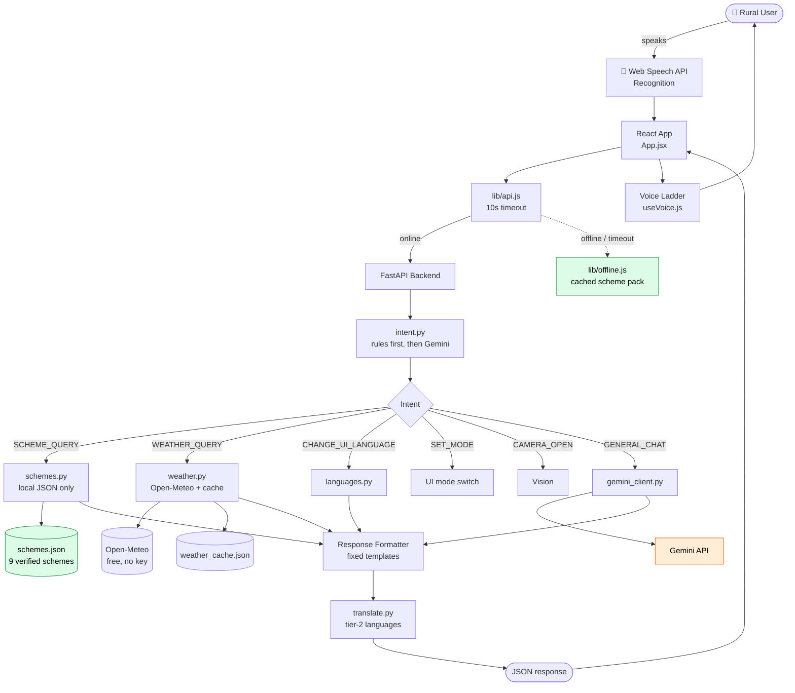

**Green = source of truth. Orange = advisory only.** Gemini never touches the
green boxes.

## 3.2 Module inventory

### Backend (11 modules)

| Module | Responsibility | Needs network? |
|---|---|---|
| `main.py` | FastAPI app, routing, startup diagnostics | — |
| `intent.py` | Two-layer intent parsing (rules → Gemini) | Rules: no |
| `schemes.py` | Local scheme search, ranking, spoken answer | **No** |
| `languages.py` | 24-language registry, script detection | **No** |
| `weather.py` | Geocode, forecast, cache, transliteration | Cache: no |
| `translate.py` | Tier-2 translation, disk-cached | Cache: no |
| `gemini_client.py` | Retry, key rotation, model failover, classification | Yes |
| `audio_cache.py` | TTS recording → WAV, indexed | Generate: yes<br/>Play: **no** |
| `prewarm.py` / `prewarm_audio.py` | Fill translation / audio caches ahead of time | Yes |
| `test_schemes.py` | 37-case matcher guard | **No** |

### Frontend (25 modules) — key ones

| Module | Responsibility |
|---|---|
| `App.jsx` | Orchestration, conversation loop, state |
| `hooks/useVoice.js` | Recognition, speech queue, anti-echo, fallback ladder |
| `lib/voices.js` | Voice selection, **script matching** |
| `lib/speechQueue.js` | Chunking long answers |
| `lib/audioCache.js` | Recorded-clip lookup and playback |
| `lib/offline.js` | Mirror of the backend matcher, on-device |
| `hooks/useOnline.js` | Reachability heartbeat |
| `hooks/useServiceHealth.js` | Per-service status |
| `components/ErrorBoundary.jsx` | Crash containment |

## 3.3 Request flow (sequence)

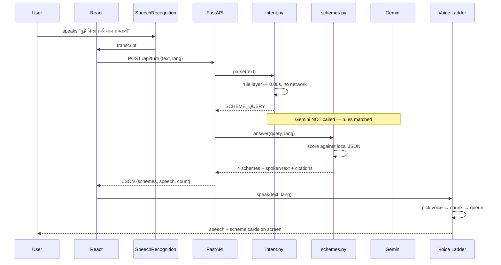

**Critical detail:** for scheme questions the rule layer matches and **Gemini is
never called**. Measured latency: **0.00s**.

## 3.4 Error handling — layered degradation

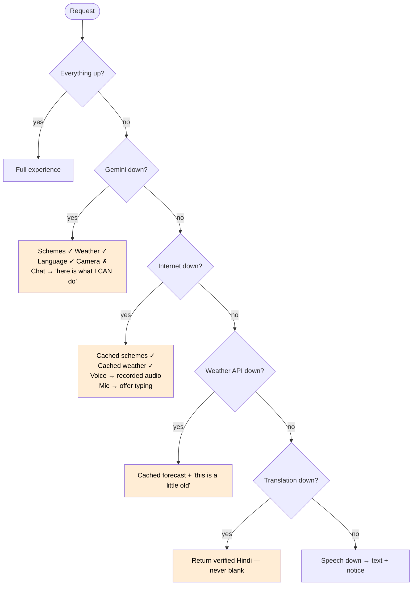

**Rule: the app never shows a blank response, an infinite spinner, or a raw
error.** Every failure has a written fallback in three languages.

---

# 4. AI Internal Working

## 4.1 The pipeline, stage by stage

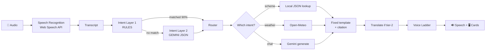

## 4.2 Why intent is two layers

| | Rule layer | Gemini layer |
|---|---|---|
| Latency | **0.00s** | 1–6s |
| Network | none | required |
| Cost | zero | quota |
| Coverage | the commands the demo depends on | everything else |

The rule layer catches **language switching, scheme queries, weather, camera,
repeat and mode switching**. This is deliberate: *the headline feature must work
when the venue wifi dies.*

## 4.3 How hallucination is prevented — the central architectural claim

> **Gemini never decides what a government scheme says.**

Gemini does exactly four things:

1. Classify intent
2. Detect the spoken language
3. Hold free conversation (weather chat, greetings)
4. Read a photo

Every scheme fact is assembled **deterministically** in `schemes.py` from
verified JSON, in the user's language, with the official link attached. The
spoken sentence comes from a **fixed template**, not from the model:

```
{name}। इसमें क्या मिलता है: {what}। कौन ले सकता है: {who}।
ज़रूरी कागज़: {papers}। कैसे लें: {how}।
यह जानकारी सरकारी वेबसाइट {link} से ली गई है।
```

**If no scheme matches, the app refuses:** *"माफ़ कीजिए, इस योजना की पक्की जानकारी
मेरे पास नहीं है। मैं अंदाज़े से नहीं बताऊँगा।"*

### The refusal is tested, not asserted

`test_schemes.py` holds **37 cases**: 25 real questions that must reach the right
scheme, and **12 questions we have no data for that must be refused**. A broad
new keyword breaks the second half immediately.

**This caught a real bug.** *"मुझे लैपटॉप के लिए सरकारी पैसा चाहिए"* (I want
government money for a laptop) once returned **crop insurance**, confidently,
with a government link under it — because two ordinary Hindi words (*पैसा*,
*लिए*) appeared in the crop-insurance prose. The fix: **only curated signals
(hand-written keywords, scheme names, categories) may CREATE a match.** Loose
prose overlap can only re-rank.

## 4.4 Ranking

| Signal | Score | Can create a match? |
|---|---|---|
| Keyword, same language | 10 | ✅ |
| Keyword, cross-language | 7 | ✅ |
| Scheme name mentioned | 15 | ✅ |
| Category synonym | 8 | ✅ |
| Descriptive prose overlap | 2/word | ❌ **rank only** |

Threshold: 4. Below it, the app says it does not know.

## 4.5 Translation architecture (tier-2)

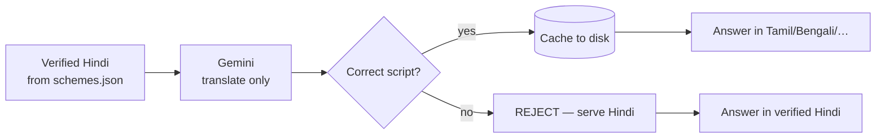

Three safety nets, **each of which caught a real bug**:

| Net | Bug it caught |
|---|---|
| **Source-hashed cache keys** | Editing a sentence left the old translation live forever |
| **Script validation** | The model returned Devanagari for a Gujarati request — rejected, not cached |
| **Language-neutral confirmations** | "I will speak Hindi" translated into Tamil = a Tamil sentence promising *Hindi* |

Links, helplines and numbers are **never** passed to the translator.

---

# 5. Complete Feature Architecture

## 5.1 Voice Assistant (hands-free conversation)

**Problem.** Village users send WhatsApp voice notes; they do not type. But most
voice UIs still require a button press per turn.

**Pain point.** Pressing a button before every sentence breaks the illusion of
conversation and is a barrier for someone unfamiliar with touchscreens.

**Why existing apps fail.** They are text apps with a microphone bolted on.

**Our solution.** After one tap, the app greets the user, then **the microphone
reopens by itself after every answer** until the user stops it.

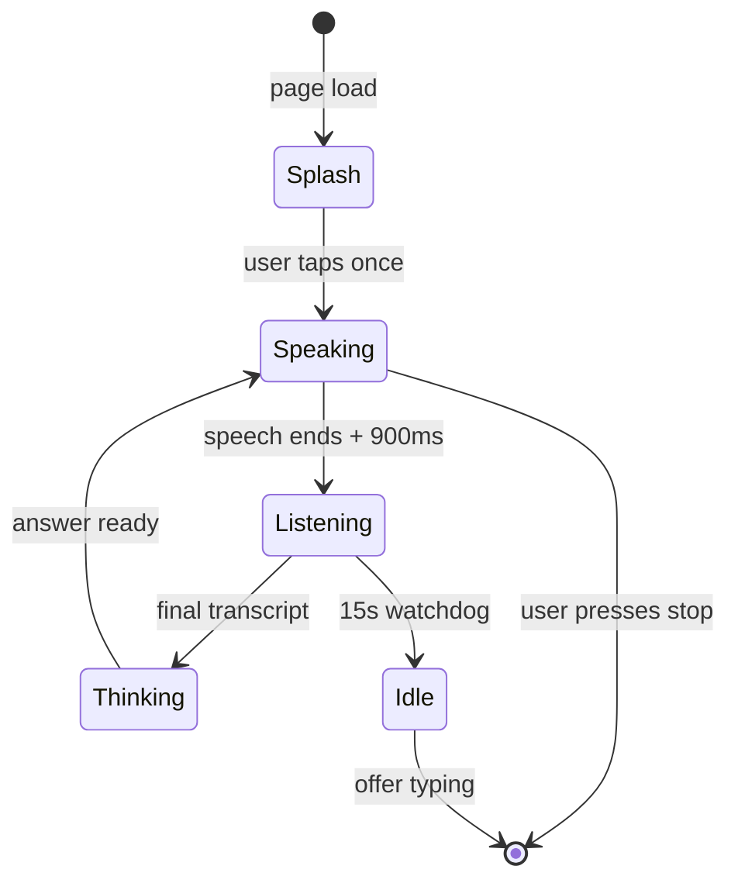

### Three engineering problems solved

**1. The app heard itself.** The mic reopened while the answer was still playing,
transcribed it, and answered its own answer — an infinite loop. Two independent
guards:
- **Timing:** the watchdog polls `synth.speaking` and refuses to open the mic
  while audio plays. Gap raised to 900ms for speaker ring.
- **Content:** any transcript within 4s of speaking is compared to what was just
  said and discarded if mostly the same words. Measured separation: **echoes
  score 0.86–1.00, genuine follow-ups 0.00–0.33.**

> A subtle bug here: Devanagari vowel signs are Unicode **Marks**, not Letters.
> Tokenising on `\p{L}` alone shattered "किस्तों" into fragments and made two
> identical Hindi sentences score **zero** overlap — the filter was silently dead
> for exactly the languages the app is for. Fixed by including `\p{M}`.

**2. Long answers stopped midway.** Chrome stops a single utterance after ~15
seconds and fires **neither `onend` nor `onerror`**. A nine-scheme answer is
5,522 characters (~4 minutes), so it died every time and the hands-free loop
hung. Fixed with a **speech queue**: split at paragraph and sentence boundaries
into ≤220-char chunks, each waiting for the previous `onend`, plus a `resume()`
keep-alive. Measured: **35 chunks, 9/9 schemes each starting their own chunk, no
text lost.**

**3. The microphone could spin forever.** `SpeechRecognition` is a *server-side*
service, so it is the first thing to die when the network drops — and it can
neither return a result nor fire `onend`. A **15-second watchdog** now always
returns the mic and offers typing.

**Edge cases:** browser blocks audio until a user gesture (hence the one-tap
splash); tab hidden (speech and mic both stop).

**Limitation:** the first tap is unavoidable — a browser security rule, not a
design choice. Say this on stage; it is more credible than claiming zero.

---

## 5.2 Government Scheme Assistant

**Problem.** Scheme information is scattered across government portals in
English, and getting it wrong costs real money.

**Current behaviour.** Villagers ask an agent, who may charge a fee or give wrong
information.

**Our solution.** A hand-verified local JSON database, searched locally, spoken
with the source attached.

### Data flow

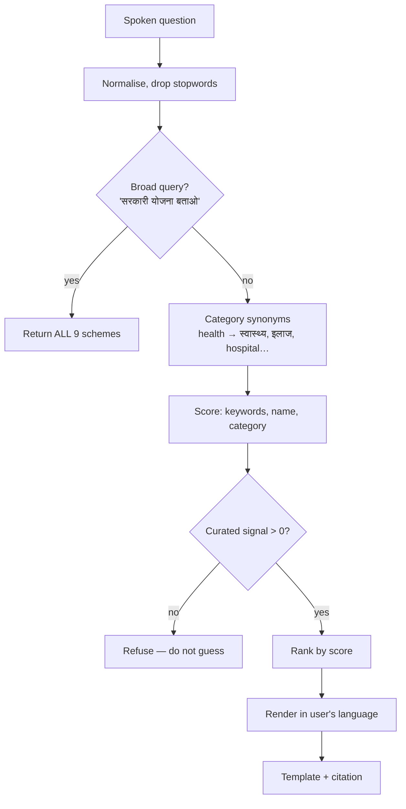

### Real example

**User:** *"सरकारी योजना बताओ"*
**Response:** *"मुझे 9 सरकारी योजनाएँ मिलीं। एक-एक करके बताता हूँ। योजना 1.
पीएम-किसान सम्मान निधि। इसमें क्या मिलता है: हर साल 6,000 रुपये…"* — all nine,
each with its own card, website button and helpline button.

### Semantic search

| Query | Returns |
|---|---|
| `सरकारी योजना बताओ` | **All 9** |
| `किसान योजना` / `farmer` | 4 farming schemes |
| `स्वास्थ्य योजना` / `health` | Ayushman Bharat |
| `रोजगार` / `job` | MGNREGA |
| `राशन` / `grain` | NFSA |
| `गरीबों की योजना` | PMAY-G, NFSA, Ayushman, NSAP |
| `मुझे लैपटॉप के लिए पैसा चाहिए` | **Refuses** |

The index is built **automatically from the JSON**. Adding a scheme makes it
searchable with no code change.

**Limitations (state these openly):**
- **9 schemes, not hundreds.** Correctness over coverage.
- **`data_status: "partial"`.** 5 of 9 portal-verified; the rest rest on
  government press releases. See §9.3.

---

## 5.3 Voice-Controlled Language Switching — the headline feature

**Problem.** Language settings live in menus. Menus require reading. The user who
needs to change language is the one who cannot read the current one.

**Our solution.** Say it.

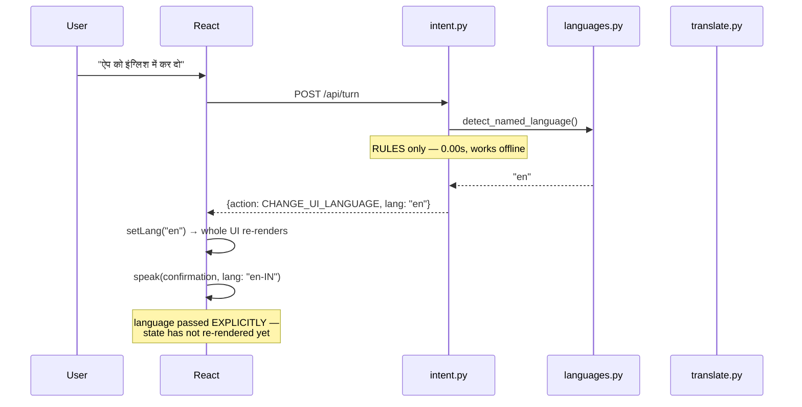

### 24 languages, two tiers

| Tier | Languages | Guarantee |
|---|---|---|
| **1** | हिंदी, English, मराठी | Every string hand-written; **works fully offline** |
| **2** | 21 more — বাংলা, தமிழ், తెలుగు, ગુજરાતી, ಕನ್ನಡ, മലയാളം, ਪੰਜਾਬੀ, ଓଡ଼ିଆ, অসমীয়া, اردو… | Machine-translated **from verified Hindi**, cached, and **labelled as such on screen** |

### Automatic detection — nobody has to ask

If a user simply *speaks* Marathi while the app is in Hindi, it switches:

- **Script detection** (offline, instant) settles Tamil, Bengali, Telugu…
- **Gemini** settles Hindi vs Marathi — both Devanagari — but **inside the intent
  call that was already happening**, so it costs zero extra requests.

**Deliberately conservative.** *"मुझे CSC सेंटर की जानकारी चाहिए"* does **not**
flip to English. Requires ≥60% of letters in one script and ≥8 characters.

> **Engineering note for the Q&A:** the first version made a *separate* Gemini
> call for detection on every Hindi turn, doubling quota burn on a free tier that
> allows 20 requests/day. The app then began reporting "no internet" on a working
> connection. Detection is now free.

---

## 5.4 Quick Action Cards

**Problem.** A blank screen asks the user to invent a question.

**Why four?** Enough to cover the main needs, few enough to scan without reading
carefully. More cards = a menu = reading.

**Why these four?** They map to the four things a rural user most often needs
from government: 🌾 **schemes** (money), 🏥 **health**, 🌦️ **weather** (today's
work), ⚖️ **rights** (MGNREGA).

**Recognition over recall.** Each card carries a **large icon AND a word**, so it
works whether or not the icon is understood.

Cards never disappear — they shrink to a scrolling strip above the composer once
a conversation starts.

---

## 5.5 Offline Mode

**Problem.** PS07 explicitly demands low-bandwidth function. Village networks are
intermittent **by default**.

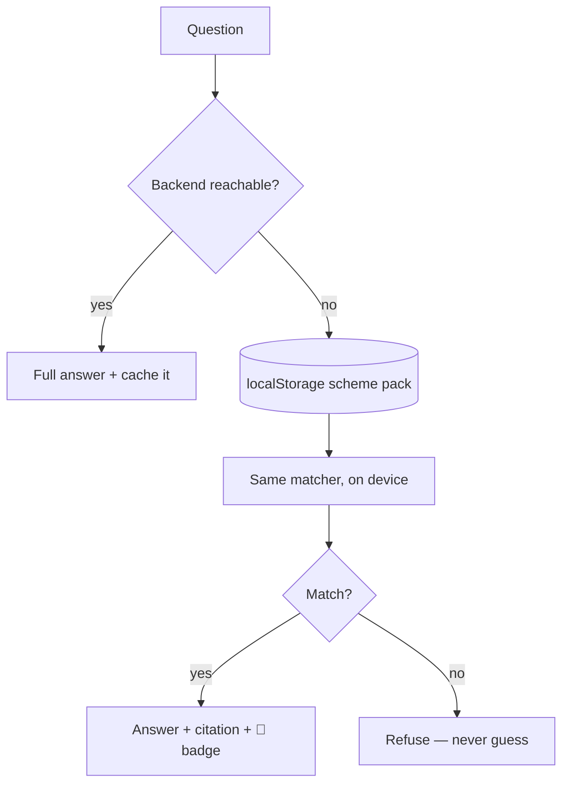

### What works offline

| Feature | Offline |
|---|---|
| Scheme lookup (all 9) | ✅ |
| Language switch (24) | ✅ |
| Weather | ✅ cached, labelled stale |
| Repeat | ✅ |
| Voice output | ✅ *if* a local voice or recording exists (§5.6) |
| Voice **input** | ❌ server-side; offers typing |
| Free chat, camera | ❌ honestly declined |

### Reachability heartbeat

`useOnline` pings `/api/health` every 8s and **self-heals**.

> **Bug worth telling:** an earlier version returned early on
> `navigator.onLine === false` and never re-checked — pinning the app offline
> forever with a healthy backend. That flag is unreliable on Windows (VPNs,
> captive portals), and this app's backend is on **localhost**, reachable with
> zero internet. It now always asks the only question that matters: *can I reach
> my own API?*

---

## 5.6 Offline Voice — the four-level ladder

**The problem nobody expects:** `speechSynthesis` works offline, but **the voices
do not**. Every Indian-language voice Chrome offers on a stock machine is one of
**Google's remote voices** — synthesised on their servers. Offline they are still
*listed*, `speak()` still resolves, and **no sound comes out and no error fires**.

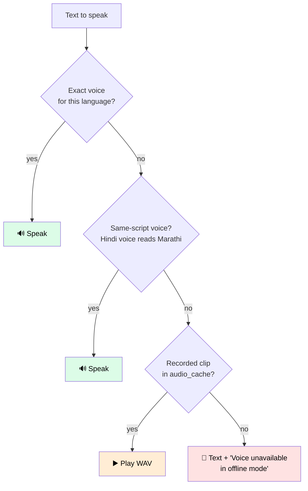

### Why script matching, not just language matching

An English engine handed Hindi text reads only what it recognises:

```
Input : "पीएम-किसान… हर साल 6,000 रुपये… CSC केंद्र… pmkisan.gov.in"
Output: "- : 6,000 : CSC , pmkisan.gov.in"     ← 16% of the answer
```

That is the *"reads only letters and numbers"* failure. A voice is now rejected
unless its script matches the text's. **Returning nothing is better than
returning 16%.**

**Level 3** plays WAVs pre-generated by Gemini TTS while online and served as
static files, so they sit in the browser's HTTP cache. 17 clips recorded.

---

## 5.7 Weather (not in the original brief — a major feature)

**Problem.** Weather decides a farmer's day: spray or not, harvest or not.

**Why Gemini cannot do this.** The model has no live data. Asked about today's
weather it says *"मेरे पास ताज़ा जानकारी नहीं है"*. Google Search grounding would
fix it but **requires a billed account** — verified: 429 on every free key.

**Our solution.** **Open-Meteo** — free, no API key, no quota.

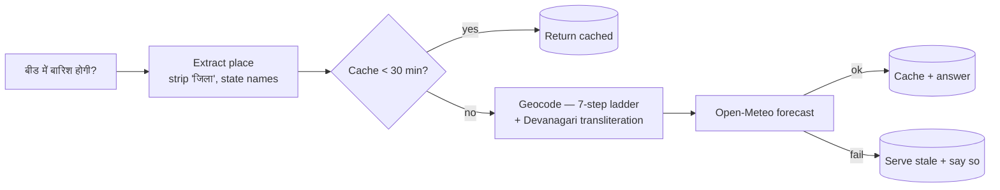

Same principle as schemes: **the model does not invent the forecast.** Numbers
are fetched; the sentence is built from them.

**Devanagari transliteration** was needed because the geocoder only accepts Latin
— `बीड` returned nothing, `Beed` works. Resolves 25/26 test cases including
`वृंदावन उत्तर प्रदेश`, `बीड जिला`, `Indore MP`.

**Safety:** if a *named* place cannot be resolved, the app **asks which
district** rather than silently returning Pune's forecast. Telling a farmer in
Jalgaon it will not rain, when that was Pune's forecast, is exactly the confident
wrong answer this project exists to avoid.

---

## 5.8 Camera Assistant

**Use cases:** crop leaf (disease visible?), medicine strip (what is it for?),
government document (which paper is this?).

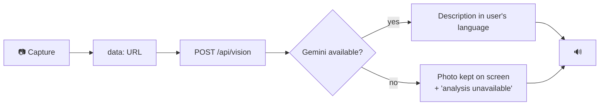

**Safety rule:** for medicine it says what it is generally used for, **never a
dose**, and tells the user to ask a doctor.

**Graceful failure:** if analysis fails the **photo still appears** — a failed
description must not look like a failed camera.

### ⚠️ Sign language — future scope only

We did **not** build Indian Sign Language recognition, and this is a deliberate,
defensible decision:

- ISL varies **state to state**; there is no dependable recogniser.
- We would have demoed 3 rehearsed signs, and a judge doing a 4th would expose it.
- **Promising inclusion we cannot deliver is worse than naming it as future work.**

---

# 6. User Journeys

## 6.1 Farmer — Ramesh, 38, Beed district

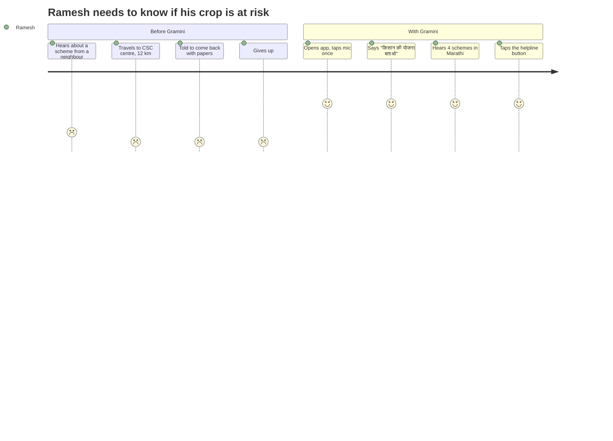

## 6.2 Elderly user — Sunita, 68

| Stage | Barrier before | With Gramini |
|---|---|---|
| Open app | Small icons | One 128px microphone |
| Ask | Cannot type | Speaks |
| Read answer | Small text | Large-text toggle + spoken |
| Change language | Buried menu | Says *"मराठीत बोल"* |
| Act | Copy phone number by hand | Taps **Call** |

## 6.3 ASHA worker — Kavita, 29

Needs **many** answers per day for **different** people. Her journey uses:
broad query (all 9 schemes), fast rule-layer responses (0.00s), offline cache
(she works in low-signal areas), and the citation to show the beneficiary.

## 6.4 Low-literacy user

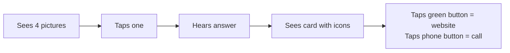

**No reading required at any step.** Icons + colour + voice carry everything.

---

# 7. AI Reasoning Flow

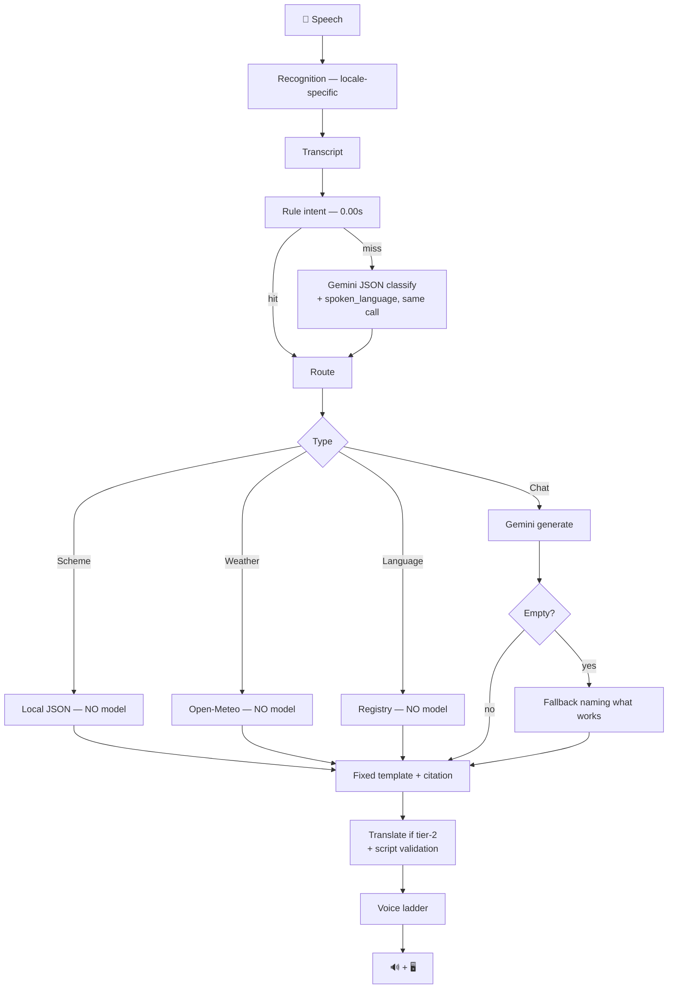

**Three of four paths never touch the model.** That is the architecture, and it
is the answer to *"isn't this just a Gemini wrapper?"*

---

# 8. Accessibility Strategy

| Decision | Who it helps | How it is verified |
|---|---|---|
| 17px → 20px toggle | Elderly, low vision | One `rem` root scales everything |
| ≥48px tap targets | Rough fingers, tremor | Measured in `min-h-tap` |
| WCAG AA contrast | Low vision, sunlight | Ratios recorded per token |
| High-contrast mode | Severe low vision | Pure black/white, heavy borders |
| Voice in **and** out | Non-readers | Both directions |
| Text **and** speech | Deaf/HoH users | Every answer is on screen too |
| Typed fallback | Speech-impaired, noisy rooms | Reachable by voice or tap |
| `prefers-reduced-motion` | Vestibular disorders | All motion off, **zero info lost** |
| `aria-live` regions | Screen readers | Answers announced |
| Language in own script | Non-Latin readers | Picker shows तमिழ், not "Tamil" |

**The principle:** every state is carried by **colour AND shape AND text** — never
colour alone, never motion alone.

---

# 9. Responsible AI

## 9.1 The one rule

> **The model never decides who is eligible for a government scheme.**

Enforced architecturally, not by prompt. `schemes.py` cannot call Gemini for
facts — it reads JSON.

## 9.2 Transparency

- Every scheme answer **speaks** its source URL aloud.
- Machine-translated languages are **labelled on screen**.
- Cached weather is labelled **"Cached"** with its age.
- Status chips show which services are live, degraded, or out.

## 9.3 Honesty about our own data — `data_status: "partial"`

We did **not** mark the data "verified". 5 of 9 schemes were read directly off
government portals; the rest rest on government press releases. The app shows a
notice, and `VERIFICATION.md` records **every fact by evidence level** —
`PORTAL` / `PIB` / `UNCHECKED`.

**Corrections this process found:**

| Scheme | Issue found |
|---|---|
| MGNREGA | `nrega.nic.in` **dead** — now `nrega.dord.gov.in` |
| Ayushman | Missing the **70+ universal** rule (since Oct 2024) — would have told an elderly user to check a list she is not on, when she qualifies automatically |
| PMAY-G | SECC-only eligibility **stale** — Awaas+ 2024 survey |
| PMFBY | Described a free payout — **never mentioned the farmer's premium** |
| MGNREGA helpline | Was **NSAP's number** |
| NSAP ages | Widow 40–59, not "40+"; disability needs *severe/multiple* |

> **Say this to judges.** Naming your own weakness is the strongest trust signal
> available, and it demonstrates the verification process is real.

## 9.4 Privacy

No login. No accounts. No history stored server-side. Nothing leaves the device
except the sentence being answered.

## 9.5 Safety

- Medicine: **never a dose**; always "ask a doctor".
- Unknown scheme: refuses rather than guessing.
- Unresolvable place: asks, rather than answering for somewhere else.

---

# 10. Future Scope

| Direction | Why | Honest status |
|---|---|---|
| **On-device LLM** | True offline reasoning | Not possible in one day; current offline mode is a cached data pack and we say so |
| **Government APIs** | Live eligibility checks | Most have no public API |
| **Personalised memory** | Remember land size, district | Needs a privacy model first |
| **Voice biometrics** | Passwordless identity | Ethical review needed |
| **Explainable AI** | Show *why* a scheme matched | Scoring already exists; needs a UI |
| **Crop prediction** | Combine soil + weather | Needs agronomic validation |
| **Indian Sign Language** | Deaf inclusion | **Deliberately not attempted** — ISL varies by state, no dependable recogniser |

---

# 11. Real-World Scenarios

## Schemes

| # | Scenario | Before | With Gramini | Impact |
|---|---|---|---|---|
| 1 | Farmer wants PM-KISAN | Agent charges ₹200 to "apply" | Speaks; hears amount, eligibility, papers, link, helpline | Saves fee; avoids middleman |
| 2 | Widow needs pension | Does not know NSAP exists | Says *"विधवा"* → NSAP + Ayushman + NFSA | Discovers 3 entitlements |
| 3 | Family needs a ration card | Told "documents missing", sent home | Hears exact document list first | One trip instead of three |

## Weather

| # | Scenario | Impact |
|---|---|---|
| 1 | Farmer about to spray pesticide | *"आज बारिश की पूरी संभावना है, 94%. छिड़काव बाद में कीजिए"* — saves a wasted spray |
| 2 | Harvest drying on the ground | Rain warning → covers grain |
| 3 | No network in the field | Cached forecast, labelled stale — still actionable |

## Voice & Language

| # | Scenario | Impact |
|---|---|---|
| 1 | Marathi speaker, app in Hindi | Speaks Marathi; app **switches by itself** |
| 2 | Elderly user cannot find settings | Says *"इंग्रजीत कर"* |
| 3 | Noisy market, mic keeps failing | 15s watchdog returns the mic, offers typing |

## Camera

| # | Scenario | Impact |
|---|---|---|
| 1 | Yellow spots on cotton leaves | Photo → is a disease visible? |
| 2 | Unlabelled medicine strip | What is it generally for? (never a dose) |
| 3 | Unknown government letter | Which document is this, what is it used for? |

## ASHA worker

| # | Scenario | Impact |
|---|---|---|
| 1 | Counselling 8 families a day | Broad query returns all 9 schemes at once |
| 2 | Low-signal village | Offline cache keeps answering |
| 3 | Beneficiary doubts her | Shows the government link on screen |

---

# 12. Judge Questions (50)

## Technical (1–12)

**1. Isn't this just a Gemini wrapper?**
No. Three of four answer paths never call the model — schemes, weather and
language switching are all local. Gemini classifies intent, holds free chat and
reads photos. The model is the *easy* part; our contribution is the interaction
and the guarantee that facts come from verified sources.

**2. Which model?** `gemini-3.5-flash` configured, with automatic failover
through a six-model chain. Currently running `gemini-3.1-flash-lite` because the
first was out of quota — the app switched **by itself**.

**3. What happens when quota runs out?** Free tier is 20 requests/day **per
model**. The client retries the same key with exponential backoff for transient
errors, rotates keys for auth errors, and rotates **models** for quota — six
deep, ≈120 requests before it must say no.

**4. How fast is a scheme answer?** **0.00s.** It never leaves the machine.

**5. How do you handle long responses?** A nine-scheme answer is 5,522 characters
(~4 min). Chrome kills a single utterance at ~15s **silently**. We chunk into
≤220-char pieces at sentence boundaries and queue them on `onend`.

**6. Does it work offline?** Schemes, language switching, cached weather and
repeat: yes. Voice input: no — recognition is server-side. We say so.

**7. What is your test coverage?** 37 scheme-matcher cases (25 must-match, 12
must-refuse), an offline suite, voice-selection suites, and chunking tests.

**8. Biggest engineering challenge?** The app hearing its own voice and answering
itself. Solved with two independent guards — timing and content overlap.

**9. Why no animation library?** CSS keyframes run on the compositor, stay smooth
on cheap phones, and let `prefers-reduced-motion` disable everything with zero
information loss. Runtime deps: `react`, `react-dom`. Bundle ~70 KB gzipped.

**10. How do you know a voice will work?** We check the **script**, not just the
language tag. An English engine reading Hindi produces 16% of the answer.

**11. What if the backend crashes?** Frontend falls back to a cached scheme pack
in localStorage using the same matcher. An `ErrorBoundary` contains render
errors; global handlers catch stray rejections.

**12. Request timeout?** 10 seconds, then abort and fall back to local data.

## AI & Hallucination (13–22)

**13. What if the AI gives wrong scheme info?** It structurally cannot. Facts are
assembled from JSON; the spoken sentence is a fixed template. If nothing matches,
it refuses.

**14. Prove the refusal works.** 12 automated must-refuse cases. It caught a real
bug: a laptop-subsidy question once returned crop insurance.

**15. How do you stop over-matching?** Only curated signals (keywords, names,
categories) may *create* a match. Prose overlap can only re-rank.

**16. How does language detection work?** Script detection offline; Gemini for
Hindi-vs-Marathi, folded into the intent call so it costs nothing extra.

**17. Could it switch language by mistake?** Guarded: ≥60% of letters in one
script, ≥8 characters, model must say `confident: true`. *"मुझे CSC सेंटर की
जानकारी चाहिए"* stays Hindi.

**18. Are the 21 extra languages trustworthy?** They are machine-translated from
**verified Hindi** and **labelled on screen**. Numbers and links never go through
the translator. Wrong-script output is rejected, not cached.

**19. Why not RAG over government portals?** Correctness over coverage. An open
retrieval system would confidently answer about schemes we have not verified.

**20. Does Gemini see user data?** Only the sentence being answered. No login, no
history, no profile.

**21. Why is the model not used for weather?** It has no live data. Grounding
needs a billed account — verified 429 on every free key. We use Open-Meteo.

**22. What if Gemini returns nothing?** Classified: quota, network, DNS, SSL,
timeout, auth, safety-block. The user gets the *right* explanation, and a message
naming what still works.

## UX & HCI (23–33)

**23. Did you actually talk to rural users?** *[Team: insert names, ages,
districts and exact quotes. This single question decides more than any feature.]*

**24. Why voice-first?** Typing Devanagari is a harder barrier than reading it.

**25. Why four cards?** Recognition beats recall. More cards become a menu, and
menus need the reading skill we design around.

**26. Why not glassmorphism?** Translucency makes contrast unprovable, and
`backdrop-filter` janks on low-end Android — our users' hardware.

**27. Why light theme by default?** A village phone is used outdoors; dark UI in
sunlight is unreadable. Dark mode is opt-in.

**28. How does a user discover what it can do?** Four cards + a spoken greeting +
a cached "help" answer.

**29. What if the user cannot speak?** Typed mode, reachable by voice or tap.

**30. What if speech recognition mishears?** The transcript is shown, so
mis-hearing is visible rather than silently producing a strange answer.

**31. Why show the URL if they cannot read?** It is *spoken* too. And a family
member or ASHA worker can verify.

**32. Is it usable one-handed?** Primary target is centred and 128px.

**33. How do you avoid overwhelming with 9 schemes?** Each gets its own card;
speech numbers them ("योजना 1…") so the user can follow by ear.

## Architecture (34–40)

**34. Why FastAPI?** Async, tiny, trivial to run offline on a laptop.

**35. Why JSON, not a database?** 9 schemes. A database adds an operational
failure mode for zero benefit, and JSON is human-reviewable — which matters when
a human must verify every line.

**36. How does a new scheme get added?** Add it to `schemes.json`. The index is
built automatically. Then run the 37-case guard.

**37. Where does state live?** React state and localStorage. No server session.

**38. How do the two matchers stay in sync?** `offline.js` mirrors `schemes.py`
deliberately, with the same scoring and guards, so an offline answer equals an
online one.

**39. Deployment?** Two processes: Uvicorn (`:8000`) and a static frontend.
Runs entirely on one laptop.

**40. Scaling?** Scheme lookup is O(n) over 9 items — microseconds. Gemini is the
only bottleneck, and three of four paths avoid it.

## Accessibility (41–45)

**41. WCAG level?** AA, ratios recorded per token in `index.css`.

**42. Screen reader support?** `aria-live` on answers, `aria-pressed` on toggles,
labels on every control, language in its own script.

**43. Deaf users?** Every spoken answer is also on screen. Typed mode available.

**44. Motor impairment?** ≥48px targets, scaling to 57px.

**45. Reduced motion?** All animation disabled; nothing is lost because every
state is also text and colour.

## Ethics & Future (46–50)

**46. Why is data marked "partial"?** Because it *is*. 5 of 9 portal-verified.
Claiming "verified" over unchecked money advice is the one mistake this project
must not make.

**47. Why no sign language?** ISL varies state to state with no dependable
recogniser. We would have shown 3 rehearsed signs. Promising inclusion we cannot
deliver is worse than naming it future work.

**48. What could go wrong in the real world?** Wrong scheme data. Mitigated by
verification discipline, visible citations, refusal-by-default, and a documented
audit trail.

**49. Who is accountable for a wrong answer?** The app never asserts eligibility
— it reports what the government portal says and links to it.

**50. What would you build next?** On-device inference for true offline
reasoning, and government API integration for live eligibility.

---

# 13. Architecture Diagrams

## 13.1 Component

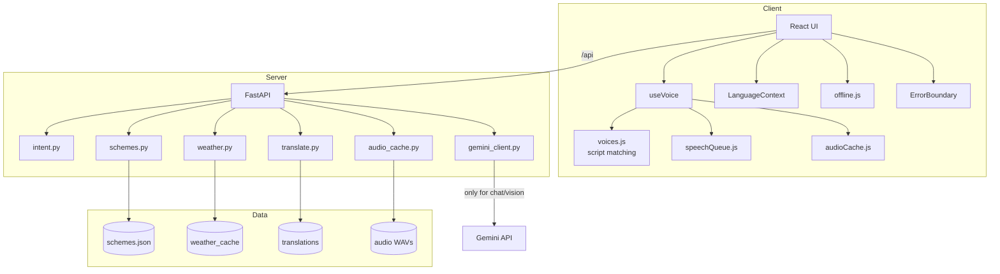

## 13.2 Data flow

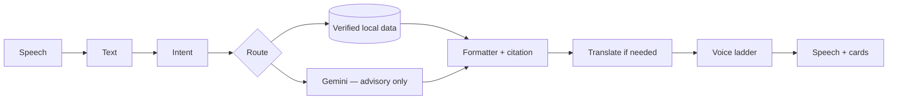

## 13.3 Voice pipeline state

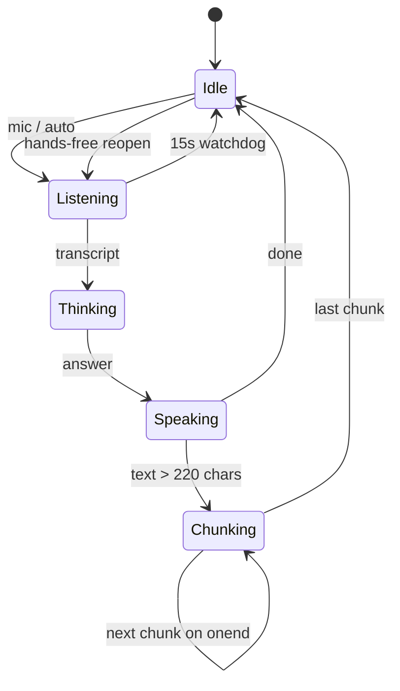

## 13.4 Offline decision

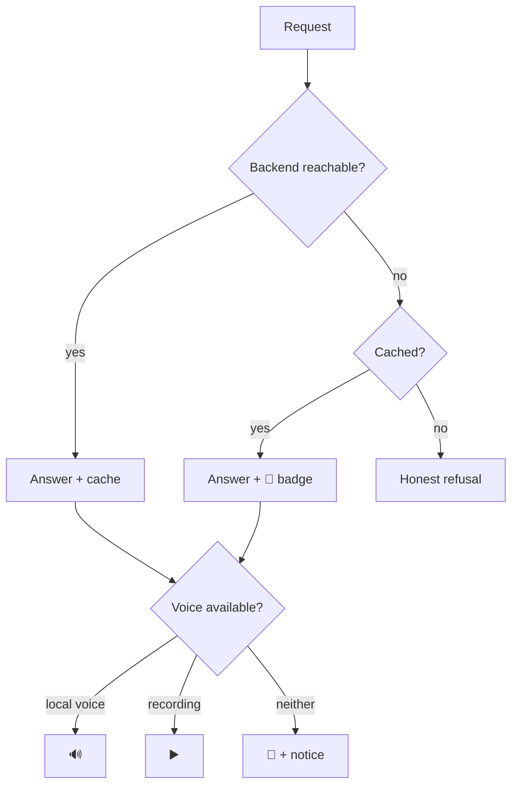

## 13.5 Deployment

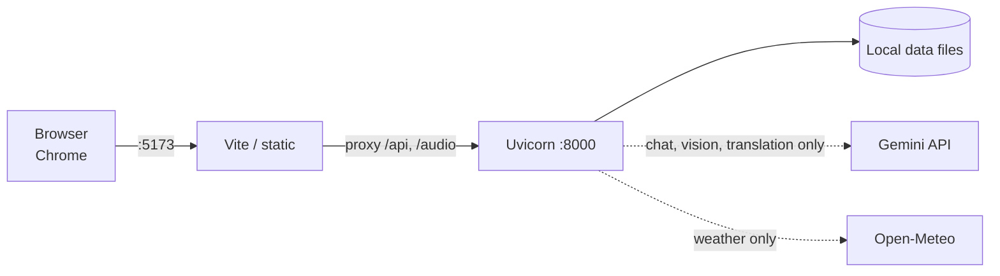

---

# 14. Conclusion

## Why Gramini is human-centered AI

It starts from a **person**, not a model. Every architectural decision traces to
a constraint of the user: they cannot type, so there is no keyboard on the
primary path; they cannot read fluently, so everything is spoken and iconified;
their network fails, so the app is offline-first; and **wrong information about
money causes real harm**, so the model is not allowed to produce facts.

## Why it is not ChatGPT

| | ChatGPT | Gramini AI |
|---|---|---|
| Entry point | Blank text box | One microphone + four pictures |
| Facts | Model memory | Verified JSON + citation |
| Wrong answer | Confident guess | **Explicit refusal** |
| Offline | Nothing | Schemes, weather, language |
| Language | You find the setting | You **say** it — or just speak it |
| Failure | Error message | Named degradation with what still works |

## Why it suits rural India

Zero typing · 24 languages · works on venue wifi and no wifi · every claim
carries a government link · nothing to install, nothing to log into.

## How it builds trust

By **refusing**. An assistant that says *"मैं अंदाज़े से नहीं बताऊँगा"* — I will
not guess — is more trustworthy than one that always has an answer. That refusal
is tested by 12 automated cases, and it exists because a real bug once offered a
farmer crop insurance for a laptop question.

---

*Document reflects the live system. Regenerate the metrics in the header from
`/api/health` before submission.*
